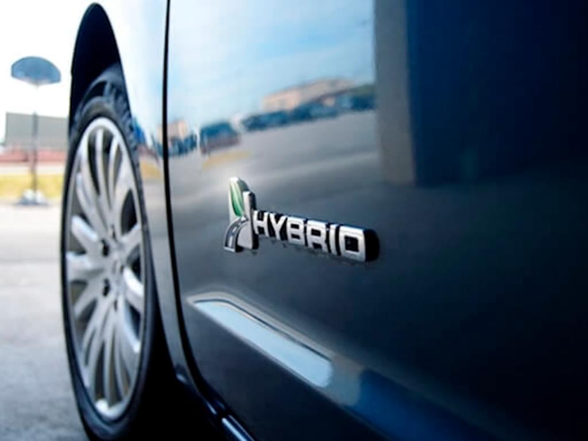

En tiempos donde el calentamiento global y el cambio climático son parte de las conversaciones del día a día, hay un tipo de vehículo que pone un granito de arena en ayudar al mejoramiento del medio ambiente y, por qué no, a nuestra economía personal: estos son los auto híbridos.   

En este artículo te contaremos qué significa que un auto sea híbrido, cuanto rinde, qué modelos puedes encontrar y cuál sería el más barato en Chile. Si estás buscando alternativas amigables con el entorno, ¡quédate! 

## ¿Qué es un auto híbrido? 

Antes de explicar concretamente qué es un auto híbrido debemos aclarar que este artículo no habla sobre automóviles eléctricos, pues los autos híbridos son una categoría que está al medio entre un vehículo que usa combustibles fósiles y otro que ocupa baterías de ion-lítio para funcionar.  

Aclarado el punto la definición aparece más clara: un auto híbrido es un vehículo que combina un motor de combustión interna (gasolina o diésel) con uno eléctrico para moverlo. En cuanto a su funcionamiento, el motor eléctrico puede asistir al de combustión interna en tareas tales como incrementar la potencia de aceleración del auto, lo que implica un menor consumo de combustible o bien llevarse la carga completa de consumo para el funcionamiento del vehículo. Asimismo, hay modelos híbridos convencionales y otros que son sólo híbridos enchufables. ¿La diferencia? Mientras los primeros poseen baterías que se auto recargan a medida que frena y avanza el auto los segundos necesitan de una fuente de poder para abastecer de energía la batería. 

## ¿Cuánto rinde un auto híbrido? 

Además de que tienen la capacidad de ahorrar combustible, el hecho de tener un motor eléctrico y otro convencional permite que los autos híbridos lleguen a tener una emisión de CO2 igual a cero, cumpliendo así con su principal propósito de no aportar a la huella de carbono. Sin embargo, la manera de medir el rendimiento de un auto híbrido puede resultar algo compleja de entender si nos referimos a vehículos con dos motores acoplados.  

Lo más simple en un auto híbrido es considerar por separado el rendimiento de ambos motores ya que, independiente de cómo funcione el auto híbrido, tanto las fuentes de poder como las unidades de medida son distintas entre sí. Entonces, así como en los autos con motor gasolinero o petrolero medimos el rendimiento en litros de combustible por cada 100 kilómetros, en los autos eléctricos se calcula en kilovatios hora (kWh) por cada 100 km. De todos modos, si hablamos de híbridos convencionales, la medición del rendimiento es conjunta, dado que la capacidad del o los motores eléctricos integrados será menor que la del motor de combustión. Así, por ejemplo, un vehículo como el Hyundai Ioniq usado tiene un rendimiento combinado de 3,4 litros por cada 100 km aproximadamente. 

Más allá del modelo específico de auto híbrido, la principal característica de los autos híbridos es que, debido a esta integración mecánica, el rendimiento de combustible es mucho más alto que el de los autos convencionales, habiendo una diferencia que puede oscilar entre un 30 y 40% menos de consumo, lo que redunda en lo que mencionamos sobre una reducción en la emisión de CO2.  

## ¿Qué autos híbridos hay en Chile? 

Varias marcas como Toyota, Hyundai y BMW, entre otras, poseen gamas de modelos de autos híbridos en Chile con distintas prestaciones, características y valores.