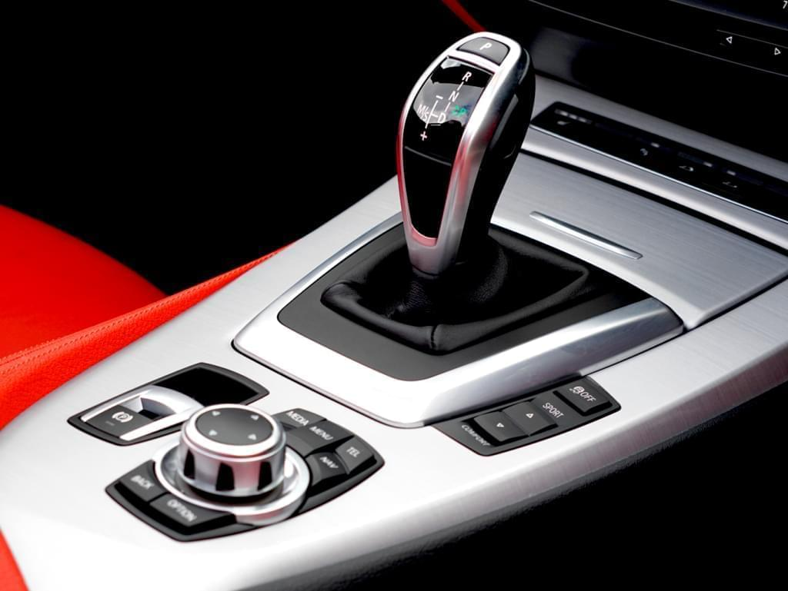

Algunos prefieran los mecánicos, otros los automáticos. Como sea, la elección de un auto usado siempre es un tema que considera diversas variables y todas igual de relevantes. En este artículo hablaremos de una de ellas: el tipo de caja de cambios que debe tener nuestro auto, más específicamente de las automáticas.

## ¿Cuáles son los autos automáticos? 

Un auto automático es un vehículo cuyo sistema de transmisión de cambios funciona sin un embrague manual que enganche y desconecte la transmisión de potencia, sino que posee un convertidor interno con engranajes ciclo-secuenciales que van determinado las marchas y revoluciones necesarios a medida que el usuario acelera o bien cambie un rango de marcha. 

Las cajas de cambio automáticas posee cuatro rangos de marchas: “Parking”, donde el auto estaciona sin ejercer transmisión de fuerza y además bloquea el eje de salida de transmisión; “Reverse” para la marcha hacia atrás; “Neutral” para no realizar transmisión de fuerza alguna y que se usa sólo en casos de emergencia; y “Drive” o “directa”, donde finalmente se ejerce la fuerza de transmisión y el auto avanza hacia las distintas velocidades que comprende el mecanismo del auto. 

Al momento de elegir un auto automático, es importante saber el tipo de caja que usa. Hay tres tipos de mecanismos: convertidor de par, doble embrague (cajas semiautomáticas) o variador continuo (CVT). En la actualidad es más común encontrar cajas automáticas con convertidor de par en autos europeos de antes del 2010 que en autos asiáticos, en especial porque fueron las marcas japonesas las que introdujeron en el mercado las cajas CVT, y dada su eficiencia en el funcionamiento, la mayoría de los modelos nuevos las han incorporado. Por lo complejo del funcionamiento de estos tres tipos de cajas es que abordaremos el asunto en otro artículo. 

## ¿Qué ventajas y desventajas tienen los autos automáticos?  

Como la diferencia entre autos automáticos y mecánicos pasa principalmente por el mecanismo de cambio de marchas en cada uno (los mecánicos usan embrague para eso y los automáticos no), toca ahondar en las ventajas y desventajas de tener un vehículo de transmisión automática. 

Como ventajas, podemos decir que los autos automáticos no sufren con el tema de las revoluciones, ya que al tener un mecanismo que controla el paso de las fuerza de movimiento el motor no se exige tanto como aquellos que funcionan en autos mecánicos. De esta manera el motor se protege mucho más y con ello se estira su vida útil. Por otro lado, la facilidad que provoca en la experiencia de conducción el no pensar qué cambios manuales debe aplicar y el tiempo de reacción que necesita es otra de las ventajas. Simplemente el conductor acelera y el mecanismo integrado del auto automático hará todo el trabajo por nosotros.  

En cuanto a las desventajas aparece el consumo de gasolina, ya que los autos automáticos gastan más gasolina que los manuales: alrededor de un 5% más de combustible. En el último tiempo las marcas han estado perfeccionando los mecanismos de sus vehículos para reducir el consumo, pero por ahora esta idea se mantiene: un auto automático gastará más gasolina que uno mecánico.  

Otra desventaja es la percepción de control que existe en torno a los autos automáticos, pensando en que a veces debes conducir por caminos complicados, ya sea cuestas, rutas no pavimentadas o carreteras con muchas curvas. En situaciones así mantener el control de las marchas es fundamental para sortear esos caminos y el auto mecánico aparece como la mejor opción, pero este es una idea que ha ido quedando un poco atrás debido a que los autos automáticos van integrando más elementos de seguridad a la experiencia de conducción en caminos complicados.  

La última desventaja suena tan trágica como posible: la mantención y reparación de una caja de cambios. Aquí, las automáticas son más costosas que las mecánicas ya que su funcionamiento y componentes la hacen un dispositivo demasiado sofisticado, por lo que repararla en caso de falla costaría mucho más dinero que una caja mecánica. De todos modos eso también se ha ido perfeccionando con el tiempo y en la actualidad es muy difícil que se arruine una caja de cambios automática, pero nunca está demás tenerlo en cuenta para cuidar mucho nuestro auto automático. 

